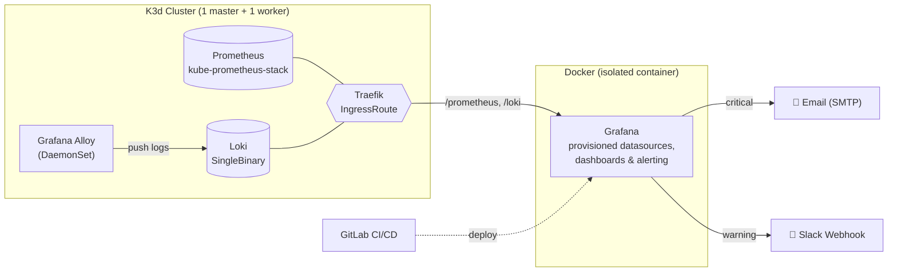
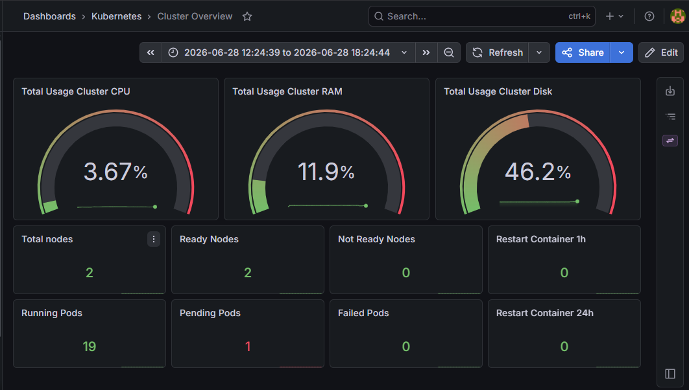
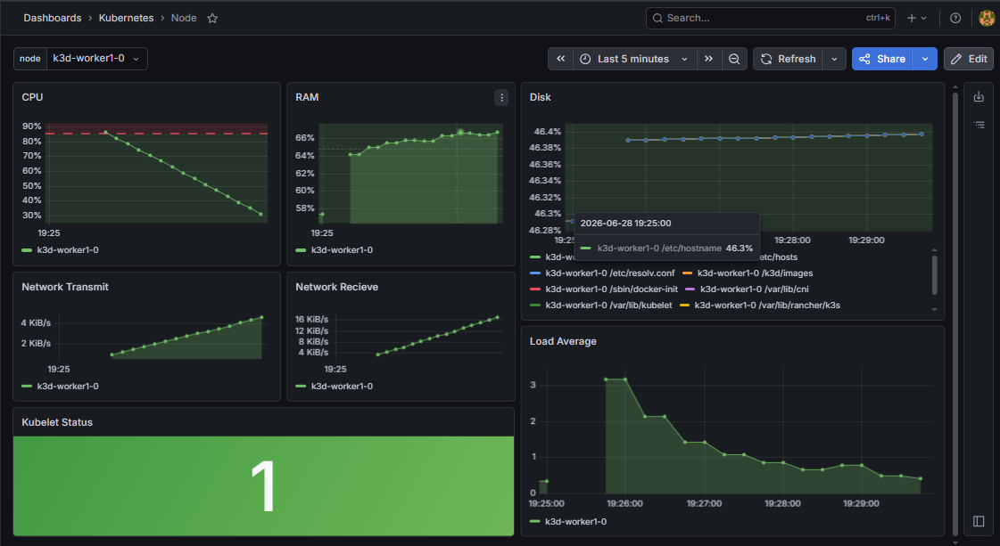
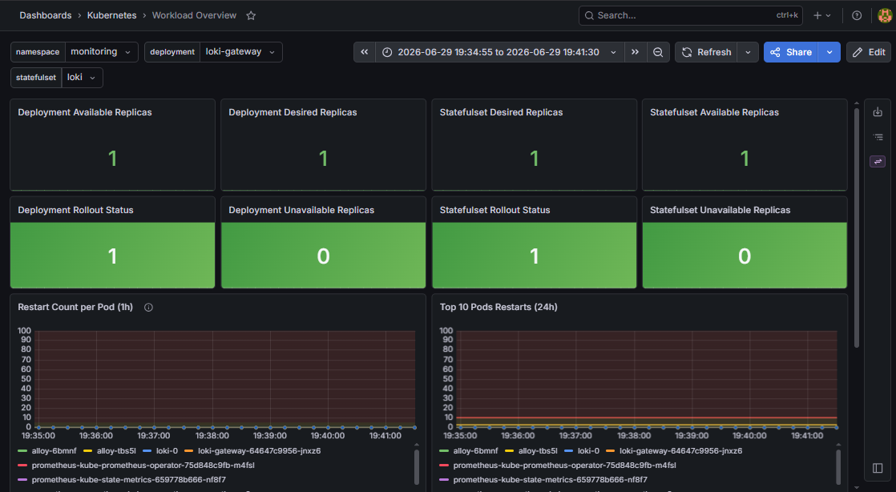
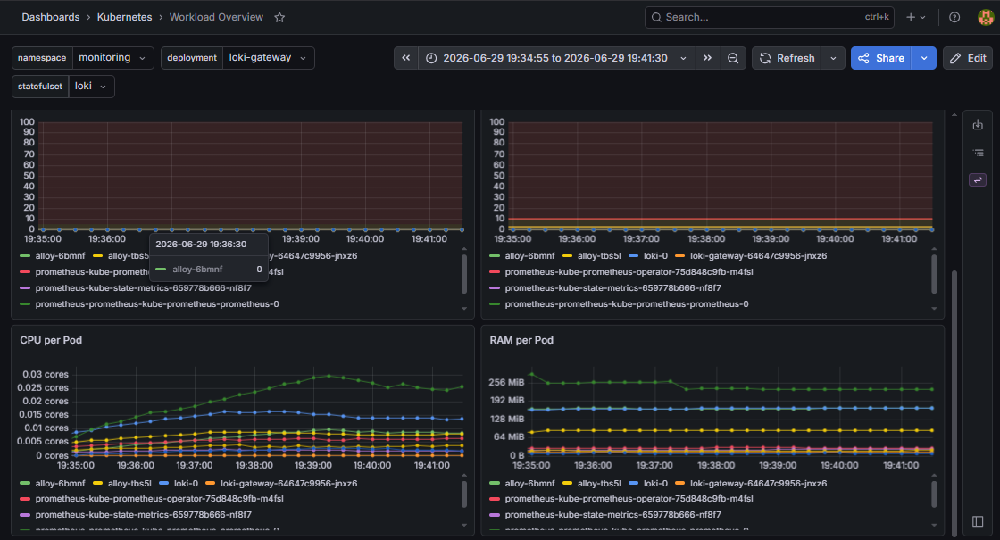
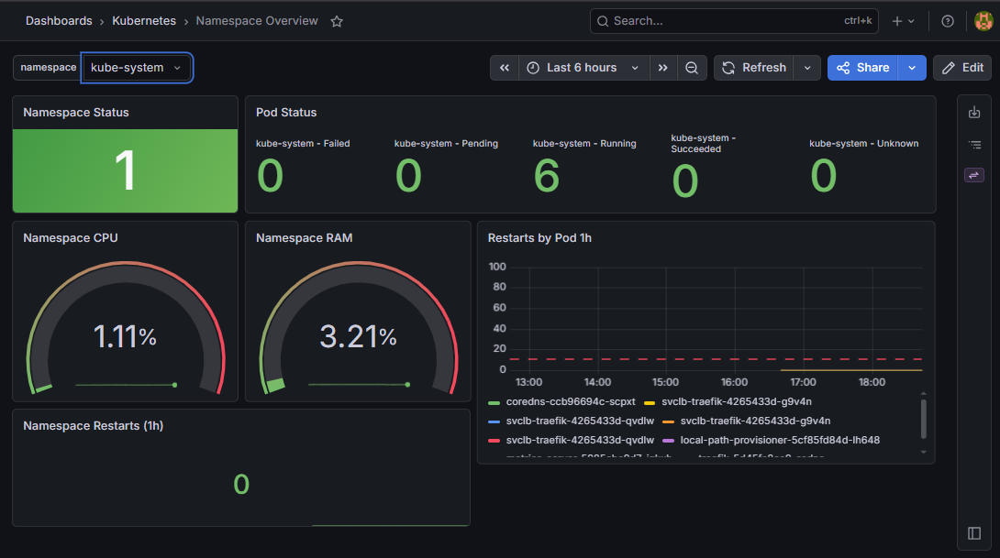
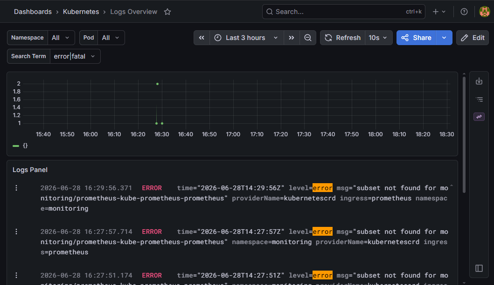

# Kubernetes Monitoring & Observability Stack

A complete, self-hosted observability platform for a Kubernetes cluster, built on **Prometheus**, **Loki**, **Grafana Alloy**, and **Grafana**. Metrics and logs are collected in-cluster, surfaced through Grafana dashboards, and wired to **email + Slack alerting** — with the whole Grafana layer provisioned as code and deployed through a **GitLab CI/CD pipeline**.

This project was built end-to-end on a self-managed VM to demonstrate a production-style monitoring setup: cluster metrics, centralized logging and alerting.

---

## Table of Contents

- [Kubernetes Monitoring \& Observability Stack](#kubernetes-monitoring--observability-stack)
  - [Table of Contents](#table-of-contents)
  - [Architecture](#architecture)
  - [Tech Stack](#tech-stack)
  - [Repository Structure](#repository-structure)
  - [How It Works](#how-it-works)
    - [1. Kubernetes Monitoring Stack](#1-kubernetes-monitoring-stack)
    - [2. Routing with Traefik](#2-routing-with-traefik)
    - [3. Grafana (Provisioned as Code)](#3-grafana-provisioned-as-code)
    - [4. Dashboards](#4-dashboards)
    - [5. Alerting](#5-alerting)
    - [6. CI/CD Automation](#6-cicd-automation)
  - [Getting Started](#getting-started)
    - [Kubernetes side](#kubernetes-side)
    - [Grafana side](#grafana-side)
  - [Screenshots](#screenshots)
  - [Key Takeaways](#key-takeaways)

---

## Architecture



**Design decision — Grafana runs outside the cluster.** Prometheus, Loki, and Alloy live inside Kubernetes, while Grafana runs in its own isolated Docker container. This keeps the visualization/alerting layer decoupled from the cluster it observes, so dashboards and alerts stay available even if the cluster is degraded, and the Grafana attack surface is separated from the workloads.

---

## Tech Stack

| Layer | Technology |
|-------|-----------|
| **Metrics** | Prometheus (via `kube-prometheus-stack` Helm chart) |
| **Logs** | Grafana Loki (SingleBinary, filesystem storage) |
| **Log collection** | Grafana Alloy (DaemonSet, Kubernetes service discovery) |
| **Visualization & Alerting** | Grafana |
| **Cluster** | Kubernetes via K3d (1 master + 1 worker) |
| **Ingress / Routing** | Traefik IngressRoute + Middleware |
| **Packaging** | Helm, Docker Compose |
| **CI/CD** | GitLab Pipelines (self-hosted runner) |
| **Notifications** | SMTP (email) + Slack webhook |

---

## Repository Structure

```
.
├── kubernetes-setup/                  # In-cluster monitoring stack (Helm values + routing)
│   ├── prometheus-values.yaml         # kube-prometheus-stack overrides
│   ├── loki-values.yaml               # Loki SingleBinary config
│   ├── alloy-values.yaml              # Alloy log pipeline (discovery → relabel → write)
│   └── monitoring-ingressroutes.yaml  # Traefik routes for Prometheus & Loki
│
└── grafana-docker/                    # Grafana, fully provisioned as code
    ├── docker-compose.yml             # Grafana container + volume mounts
    ├── env.example                    # Required secrets (SMTP, Slack, alert email)
    ├── gitlab-ci.yml                  # CI/CD pipeline definition
    ├── dashboards/                    # Dashboard JSON models
    │   ├── cluster-dashboard.json
    │   ├── node-dashboard.json
    │   ├── namespace-dashboard.json
    │   ├── workload-dashboard.json
    │   └── logs-dashboard.json
    └── provisioning/                  # Auto-loaded on startup
        ├── datasources/               # Prometheus + Loki datasources
        ├── dashboards/                # Dashboard provider config
        └── alerting/                  # Contact points, notification policy, alert rules
```

---

## How It Works

### 1. Kubernetes Monitoring Stack

The in-cluster components are installed from their official Helm charts, each customized with a `values.yaml` to fit a small two-node cluster:

- **Prometheus** (`prometheus-values.yaml`) — installed via `kube-prometheus-stack`. The bundled Grafana and Alertmanager are **disabled** (Grafana is run separately; alerting is handled in Grafana). Scrape/evaluation intervals are set to `30s` with a `24h` retention window and tight CPU/memory limits suited to a lab cluster.
- **Loki** (`loki-values.yaml`) — deployed in **SingleBinary** mode with `filesystem` storage and a TSDB schema (`v13`). The default caching layers (chunk/results Memcached), the self-monitoring canary, and Helm test hooks are disabled to trim the deployment to only what a small lab cluster needs, reducing resource usage.
- **Alloy** (`alloy-values.yaml`) — runs as a **DaemonSet** so every node ships logs. Its pipeline uses Kubernetes service discovery to find pods, relabels each log stream with meaningful labels (`namespace`, `pod`, `container`, `app`), and pushes to Loki via the gateway:

  ```
  discovery.kubernetes  →  discovery.relabel  →  loki.source.kubernetes  →  loki.write
  ```

During setup, `kubectl port-forward` was used to validate that Prometheus and Loki were scraping/ingesting correctly before exposing them.

### 2. Routing with Traefik

Instead of leaving port-forwards in place, Prometheus and Loki are exposed to Grafana through **Traefik IngressRoutes** (`monitoring-ingressroutes.yaml`):

- `PathPrefix(/prometheus)` → routed to the Prometheus service, with a **StripPrefix middleware** so Prometheus receives clean paths.
- `PathPrefix(/loki)` → routed to the Loki gateway service.

This gives Grafana a stable HTTP entrypoint for both datasources.

### 3. Grafana (Provisioned as Code)

Grafana runs in Docker (`docker-compose.yml`) and is **100% provisioned on startup** — no manual clicking required. The image is pinned to a specific version (`13.0.2`) instead of `latest`, so deployments are reproducible and a new release can't break things unexpectedly. Everything is mounted from `provisioning/`:

- **Datasources** (`datasources/datasources.yml`) — Prometheus (default) and Loki, both pointing at the Traefik entrypoint via `host.docker.internal`.
- **Dashboards** (`dashboards/dashboards.yml`) — a file provider that auto-loads every dashboard JSON into a `Kubernetes` folder.
- **Alerting** (`alerting/`) — contact points, notification policies, and alert rules (see below).

Secrets (SMTP credentials, Slack webhook, alert recipient) are injected via environment variables — see [`env.example`](grafana-docker/env.example).

### 4. Dashboards

Five dashboards were built to cover the cluster from different angles, then **exported as JSON** so they can be version-controlled and re-imported anywhere:

| Dashboard | Focus |
|-----------|-------|
| **Cluster** | Cluster-wide health and capacity overview |
| **Node** | Per-node CPU, memory, disk, and readiness |
| **Namespace** | Resource usage broken down by namespace |
| **Workload** | Deployments, pods, restarts, and workload state |
| **Logs** | Centralized log exploration powered by Loki |

### 5. Alerting

Alerting is provisioned declaratively (`provisioning/alerting/`) and split by severity through a **notification policy**:

- **Critical** → routed so that infrastructure-level problems reach **email (SMTP)**.
- **Warning** → routed to a **Slack webhook**.
- The routing tree uses `continue: true` so an alert can fan out to **both Slack and email** when appropriate.

Provisioned alert rules include:

| Rule | Severity | Trigger |
|------|----------|---------|
| Node CPU Above 85% | critical | Sustained node CPU > 85% |
| Node RAM Above 90% | critical | Node memory > 90% |
| Disk Above 80% | critical | Filesystem usage > 80% |
| Node Not Ready | critical | `Ready` condition false/unknown |
| Deployment Replicas Unavailable | critical | Unavailable replicas > 1 for 5m |
| Pod CrashLoopBackOff | warning | Container stuck in CrashLoopBackOff |
| High Number of Restarts | warning | > 5 restarts in 30m |
| Pod Pending | warning | Pod pending > 15m |
| Frequent Log Errors | warning | Spike of error/exception logs in Loki |

Alert rules and contact points are exported as JSON/YAML alongside the dashboards, so the entire alerting setup is reproducible.

### 6. CI/CD Automation

The whole Grafana deployment is automated in a **GitLab pipeline** ([`gitlab-ci.yml`](grafana-docker/gitlab-ci.yml)). On every push to `main`, a self-hosted runner redeploys it:

```yaml
deploy:
  stage: deploy
  script:
    - cd grafana-docker
    - docker-compose up -d
  rules:
    - if: '$CI_COMMIT_BRANCH == "main"'
  tags:
    - grafana-runner
```

This turns dashboard/alert changes into a simple `git push` — provisioning and redeployment happen automatically.

---

## Getting Started

> **Prerequisites:** Docker, Kubernetes, kubectl, and Helm installed on the host.

### Kubernetes side

```bash
# Create the monitoring namespace
kubectl create namespace monitoring

# Add the Helm repos and refresh the index
helm repo add prometheus-community https://prometheus-community.github.io/helm-charts
helm repo add grafana https://grafana.github.io/helm-charts
helm repo update

# Install the Prometheus stack (kube-prometheus-stack) with custom values
helm install monitoring prometheus-community/kube-prometheus-stack -f kubernetes-setup/prometheus-values.yaml -n monitoring

# Install Loki (log backend) with custom values
helm install loki grafana/loki -f kubernetes-setup/loki-values.yaml -n monitoring

# Install Alloy to discover pods and push their logs to Loki
helm install alloy grafana/alloy -f kubernetes-setup/alloy-values.yaml -n monitoring

# Expose Prometheus & Loki through Traefik
kubectl apply -f kubernetes-setup/monitoring-ingressroutes.yaml
```

### Grafana side

```bash
cd grafana-docker

# Configure secrets
cp env.example .env
# edit .env → SMTP_USER, SMTP_PASSWORD, SLACK_WEBHOOK_URL, ALERT_EMAIL

# Launch Grafana with everything provisioned
docker-compose up -d
```

Grafana is then available at **http://localhost:3000** with datasources, dashboards, and alerting already loaded.

> ⚠️ The default admin credentials and example secrets in this repo are for **local/demo use only**. Replace them before any real deployment.

---

## Screenshots

> _Dashboard screenshots below._

| Cluster Overview | Node |
|---|---|
|  |  |

| Workload | Workload (continued) |
|---|---|
|  |  |

| Namespace | Logs |
|---|---|
|  |  |

---

## Key Takeaways

This project demonstrates hands-on experience with:

- **Kubernetes observability** — metrics (Prometheus), centralized logging (Loki), and node-level collection (Alloy DaemonSet).
- **Helm chart customization** — tuning third-party charts with `values.yaml` for a constrained environment.
- **Ingress & routing** — exposing in-cluster services via Traefik IngressRoutes and middleware.
- **Configuration as Code** — fully provisioned Grafana (datasources, dashboards, alerting) with zero manual setup.
- **Alerting design** — severity-based routing to email and Slack with meaningful, label-rich alert messages.
- **CI/CD** — automated deployment through a GitLab pipeline on a self-hosted runner.
- **Security-minded architecture** — isolating Grafana from the cluster it monitors and keeping secrets out of version control.
